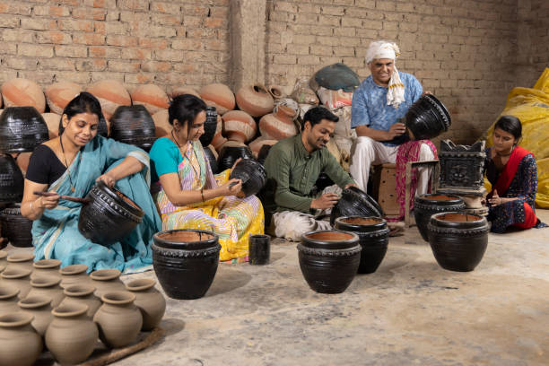

# SaptaBhumi

[](https://saptabhumi.vercel.app)
[](LICENSE)

## Table of Contents
- [Overview](#overview)
- [Mission & Vision](#mission--vision)
- [Live Demo](#live-demo)
- [Screenshots](#screenshots)
- [Features](#features)
- [Technology Stack](#technology-stack)
- [Project Structure](#project-structure)
- [Getting Started](#getting-started)
- [Usage](#usage)
- [Deployment](#deployment)
- [Contribution Guidelines](#contribution-guidelines)
- [FAQ](#faq)
- [Roadmap](#roadmap)
- [Contact & Support](#contact--support)
- [Credits & Acknowledgements](#credits--acknowledgements)

---

## Overview
**SaptaBhumi** is a modern, open-source web platform dedicated to preserving, showcasing, and promoting the rich artisanal heritage of India, with a special focus on Northeast Indian crafts. The platform bridges traditional craftsmanship with contemporary technology, offering a curated marketplace, educational resources, AI-powered tools, and a vibrant community for artisans, collectors, and enthusiasts.

## Mission & Vision
- **Empower Artisans:** Provide a digital platform for artisans to showcase and sell their work globally.
- **Preserve Heritage:** Document and promote traditional crafts, techniques, and stories.
- **Educate & Inspire:** Offer courses, workshops, and resources to foster learning and appreciation.
- **Innovate Commerce:** Use AI and modern web technologies to enhance discovery, commerce, and storytelling.
- **Build Community:** Connect artisans, collectors, and enthusiasts in a collaborative environment.

## Live Demo
🌐 [https://saptabhumi.vercel.app](https://saptabhumi.vercel.app)

## Screenshots
> _Add screenshots or GIFs here to showcase the UI and features._

- 
- 
- 

## Features
### 🏺 Products Marketplace
- Curated collection of antique and handcrafted artifacts (pottery, jewelry, textiles, art, etc.)
- Advanced filtering by category, period, and price
- Detailed product pages with history, materials, and artisan stories

### 🤖 AI-Assisted E-Commerce
- AI-powered product detail generation for sellers
- Smart upload and categorization tools
- Dashboard with product stats and sales insights

### 🎓 Courses & Workshops
- Online courses on pottery, weaving, sculpting, and more
- Multilingual support (Assamese, Bodo, Manipuri, etc.)
- Workshop event listings and reservation system

### 🏛️ Community Forum
- Q&A and discussion board for customers, artisans, and businesses
- Real-time notifications, likes, replies, and bookmarking
- Verified seller/admin responses and business support

### 🖼️ Gallery
- Visual showcase of unique handcrafted pieces and award-winning collections
- Bento-style grid for immersive browsing

### 📞 Contact & Support
- Direct contact form for queries and support
- Business hours, location, and multiple contact channels

## Technology Stack
- **Framework:** Next.js 15 (App Router, TypeScript)
- **Styling:** Tailwind CSS, custom themes, Framer Motion for animations
- **UI Components:** shadcn/ui, Radix UI, Lucide Icons
- **State & Data:** React hooks, local state (demo), extensible for backend integration
- **AI Integration:** Simulated AI product detail generation (ready for API integration)
- **Image Handling:** next/image for optimized media
- **Hosting:** Vercel

## Project Structure
```
SaptaBhumi/
├── src/
│   ├── app/
│   │   ├── components/      # Reusable UI and feature components
│   │   ├── products/        # Marketplace page
│   │   ├── ai-com/          # AI commerce tools
│   │   ├── courses/         # Courses and workshops
│   │   ├── community-forum/ # Forum and Q&A
│   │   ├── contact/         # Contact page
│   │   └── ...
│   ├── components/ui/       # UI primitives (button, card, etc.)
│   └── lib/                 # Utilities
├── public/                  # Images and static assets
├── tailwind.config.ts       # Tailwind CSS config
├── package.json             # Dependencies and scripts
└── ...
```

## Getting Started
1. **Clone the repository:**
   ```bash
   git clone https://github.com/dineshdinz12/Saptabhumi.git
   cd Saptabhumi
   ```
2. **Install dependencies:**
   ```bash
   npm install
   # or
   yarn install
   ```
3. **Run the development server:**
   ```bash
   npm run dev
   # or
   yarn dev
   ```
4. Open [http://localhost:3000](http://localhost:3000) to view the app.

## Usage
- Browse the marketplace for unique handcrafted products.
- Register/login to access personalized features.
- Use the AI commerce tools to upload and describe your own products.
- Enroll in courses and reserve spots in workshops.
- Join the community forum to ask questions and connect with others.
- Contact support for any queries or assistance.

## Deployment
- Deployed on [Vercel](https://vercel.com/)
- Production: [https://saptabhumi.vercel.app](https://saptabhumi.vercel.app)

## Contribution Guidelines
We welcome contributions! Please:
- Fork the repository
- Create a new branch (`git checkout -b feature/your-feature`)
- Commit your changes (`git commit -m 'Add some feature'`)
- Push to the branch (`git push origin feature/your-feature`)
- Open a Pull Request

For major changes, please open an issue first to discuss what you would like to change.

## FAQ
**Q: Who can use SaptaBhumi?**  
A: Anyone interested in Indian crafts—artisans, collectors, learners, and enthusiasts.

**Q: Is there a fee for artisans to join?**  
A: The platform is free for artisans to join and list their products. (Future premium features may be added.)

**Q: How does the AI product description work?**  
A: The AI tool generates detailed product descriptions based on images and basic info, helping sellers save time and improve listings.

**Q: Can I contribute new features?**  
A: Yes! We welcome open source contributions. See the [Contribution Guidelines](#contribution-guidelines).

## Roadmap
- [ ] Backend integration for real-time data and authentication
- [ ] Payment gateway for direct purchases
- [ ] Mobile app version
- [ ] More languages and localization
- [ ] Enhanced AI features (image recognition, smart recommendations)
- [ ] Artisan verification and certification system
- [ ] Community events and live workshops

## Contact & Support
- **Email:** r.dineshdinz12@gmail.com
- **GitHub Issues:** [Open an issue](https://github.com/dineshdinz12/Saptabhumi/issues)

## Credits & Acknowledgements
- Artisans and creators featured on SaptaBhumi
- Open source libraries: Next.js, Tailwind CSS, shadcn/ui, Framer Motion, Lucide Icons, Radix UI
- [Vercel](https://vercel.com/) for hosting

---
SaptaBhumi © 2025. All rights reserved.
